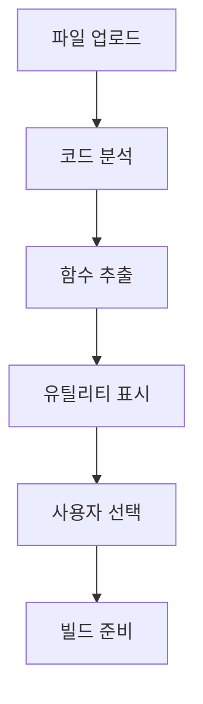
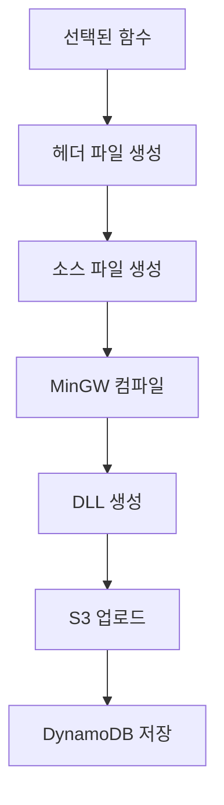
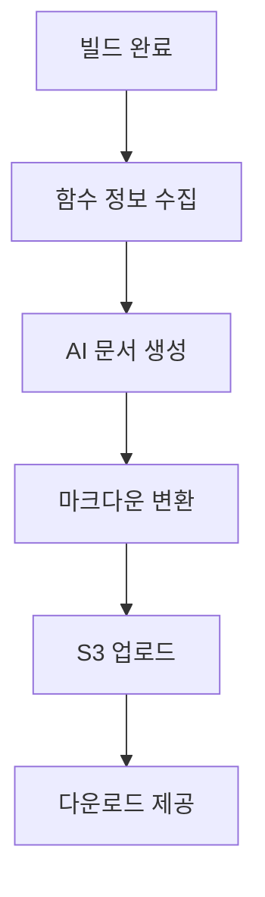

# 유틸리티 추출 시스템 구조 및 설계 문서

## 📋 개요

C++ 코드에서 유틸리티 함수를 자동으로 추출하고, 컴파일하여 DLL로 빌드하며, AI 기반 문서를 생성하는 웹 기반 시스템입니다.

**생성일**: 2025-09-29  
**버전**: 1.0  

---

## 🏗️ 시스템 아키텍처

### 전체 구조
```
┌─────────────────┐    ┌─────────────────┐    ┌─────────────────┐
│   Frontend      │    │   Backend       │    │   External      │
│   (HTML/JS)     │◄──►│   (FastAPI)     │◄──►│   Services      │
└─────────────────┘    └─────────────────┘    └─────────────────┘
│                      │                      │
├─ 유틸리티 추출       ├─ 코드 분석          ├─ AWS Bedrock
├─ 추출 히스토리       ├─ 컴파일 & 빌드      ├─ AWS S3
├─ 빌드 히스토리       ├─ 문서 생성          ├─ AWS DynamoDB
└─ 진행률 표시         └─ 데이터 저장        └─ MinGW Compiler
```

### 주요 컴포넌트

#### 1. Frontend (Web Interface)
- **파일**: `advanced_utility_extractor.html`
- **기술**: HTML5, JavaScript, CSS3
- **기능**:
  - 3개 탭 인터페이스 (유틸리티 추출, 추출 히스토리, 빌드 히스토리)
  - 파일 업로드 (드래그 앤 드롭, 파일 선택)
  - 코드 직접 입력
  - 실시간 진행률 표시
  - 함수 선택/해제 UI

#### 2. Backend (API Server)
- **파일**: `aws_backend.py`
- **기술**: FastAPI, Python 3.x
- **포트**: 8000
- **주요 엔드포인트**:
  - `/analyze` - 코드 분석
  - `/build` - DLL 빌드
  - `/generate_docs/{build_id}` - 문서 생성
  - `/extraction_history` - 추출 히스토리
  - `/builds` - 빌드 히스토리
  - `/download/{build_id}` - 파일 다운로드

#### 3. AI Agent System
- **파일**: `agents/agent_wrapper.py`
- **기능**:
  - 코드 분석 및 함수 추출
  - 코드 리팩토링
  - 문서 자동 생성
  - AWS Bedrock 연동

---

## 🔧 핵심 기능

### 1. 유틸리티 추출


**처리 과정**:
1. 사용자가 C++ 파일 업로드 또는 직접 입력
2. AI Agent가 코드 분석하여 재사용 가능한 함수 식별
3. 함수별 메타데이터 생성 (이름, 설명, 목적, 매개변수 등)
4. 웹 UI에서 함수 목록 표시
5. 사용자가 빌드할 함수 선택

### 2. 빌드 시스템


**빌드 과정**:
1. 선택된 함수들을 하나의 소스 파일로 결합
2. C++ 헤더 파일 자동 생성
3. MinGW를 사용하여 DLL 컴파일
4. 생성된 파일들을 S3에 업로드
5. 빌드 정보를 DynamoDB에 저장

### 3. 문서 생성


**문서 생성 과정**:
1. 빌드된 함수들의 메타데이터 수집
2. AWS Bedrock을 통한 AI 문서 생성
3. 마크다운 형식으로 변환
4. S3에 업로드 후 다운로드 링크 제공

---

## 📊 데이터 구조

### DynamoDB 스키마
```json
{
  "build_id": "string (Primary Key)",
  "timestamp": "string (ISO 8601)",
  "comment": "string",
  "utility_count": "number",
  "utilities": [
    {
      "name": "string",
      "description": "string",
      "purpose": "string",
      "code": "string",
      "parameters": "string",
      "return_type": "string",
      "header_declaration": "string",
      "required_headers": ["string"]
    }
  ],
  "doc_url": "string (optional)"
}
```

### S3 저장 구조
```
bucket-name/
├── {build_id}.dll          # 컴파일된 DLL 파일
├── {build_id}.h            # 헤더 파일
└── {build_id}_docs.md      # 생성된 문서
```

---

## 🎯 사용자 워크플로우

### 1. 유틸리티 추출 워크플로우
```
파일 업로드/코드 입력 → 분석 → 함수 선택 → 빌드 → 다운로드
```

### 2. 추출 히스토리 워크플로우
```
히스토리 조회 → 함수 검색 → 함수 선택 → 유틸리티 추출기에 추가
```

### 3. 빌드 히스토리 워크플로우
```
히스토리 조회 → DLL/헤더 다운로드 → 문서 생성 → 문서 다운로드
```

---

## 🔌 API 엔드포인트

### 코드 분석
- **POST** `/analyze`
- **Body**: `{"files": [{"name": "string", "content": "string", "type": "string"}]}`
- **Response**: 추출된 유틸리티 함수 목록

### 빌드 실행
- **POST** `/build`
- **Body**: `{"utilities": [...], "comment": "string"}`
- **Response**: 빌드 결과 및 다운로드 링크

### 히스토리 조회
- **GET** `/builds` - 빌드 히스토리
- **GET** `/extraction_history` - 추출 히스토리
- **POST** `/search_functions` - 함수 검색

### 파일 다운로드
- **GET** `/download/{build_id}` - DLL 다운로드
- **GET** `/download/{build_id}/header` - 헤더 다운로드
- **GET** `/download/{build_id}/docs` - 문서 다운로드

### 문서 생성
- **GET** `/generate_docs/{build_id}` - AI 문서 생성

---

## 🛠️ 기술 스택

### Frontend
- **HTML5**: 구조 및 마크업
- **CSS3**: 스타일링 및 애니메이션
- **JavaScript (ES6+)**: 동적 기능 및 API 통신
- **Fetch API**: 비동기 HTTP 요청

### Backend
- **Python 3.x**: 메인 언어
- **FastAPI**: 웹 프레임워크
- **Uvicorn**: ASGI 서버
- **Boto3**: AWS SDK

### AI & ML
- **AWS Bedrock**: AI 모델 서비스
- **Claude (Anthropic)**: 코드 분석 및 문서 생성

### 컴파일러
- **MinGW**: Windows용 GCC 컴파일러
- **GCC**: C++ 컴파일러

### 클라우드 서비스
- **AWS S3**: 파일 저장소
- **AWS DynamoDB**: NoSQL 데이터베이스
- **AWS Bedrock**: AI 서비스

---

## 📁 파일 구조

```
server/
├── aws_backend.py              # 메인 백엔드 서버
├── advanced_utility_extractor.html  # 프론트엔드 UI
├── aws_config.py               # AWS 설정
├── function_extractor.py       # 함수 추출 로직
├── agents/
│   └── agent_wrapper.py        # AI Agent 래퍼
└── system_architecture.md      # 이 문서
```

---

## 🔄 데이터 플로우

### 1. 코드 분석 플로우
```
사용자 입력 → 파일 파싱 → AI 분석 → 함수 추출 → 메타데이터 생성 → UI 표시
```

### 2. 빌드 플로우
```
함수 선택 → 코드 결합 → 헤더 생성 → 컴파일 → DLL 생성 → 클라우드 업로드 → DB 저장
```

### 3. 히스토리 플로우
```
DB 조회 → 데이터 가공 → UI 표시 → 사용자 선택 → 재사용/다운로드
```

---

## 🚀 성능 최적화

### Frontend 최적화
- **캐시 방지**: 메타 태그로 브라우저 캐시 제어
- **비동기 처리**: Promise 기반 API 호출
- **진행률 표시**: 사용자 경험 향상
- **인라인 스타일**: 빠른 렌더링

### Backend 최적화
- **비동기 처리**: FastAPI의 async/await 활용
- **임시 파일 관리**: 컴파일 후 자동 정리
- **오류 처리**: 포괄적인 예외 처리
- **로깅**: 디버깅 및 모니터링

### 클라우드 최적화
- **S3 직접 업로드**: 서버 부하 감소
- **DynamoDB 인덱싱**: 빠른 조회
- **Bedrock 모델 선택**: 비용 효율적인 AI 모델

---

## 🔒 보안 고려사항

### 입력 검증
- 파일 타입 제한 (.cpp, .c, .h)
- 파일 크기 제한
- 코드 내용 검증

### 컴파일 보안
- 임시 디렉토리 사용
- 컴파일 후 파일 정리
- 안전한 컴파일 옵션

### 클라우드 보안
- AWS IAM 역할 기반 접근
- S3 버킷 정책
- DynamoDB 암호화

---

## 📈 확장 가능성

### 기능 확장
- 다른 언어 지원 (Python, Java, C# 등)
- 더 많은 컴파일러 지원
- 고급 코드 분석 기능
- 팀 협업 기능

### 인프라 확장
- 컨테이너화 (Docker)
- 마이크로서비스 아키텍처
- 로드 밸런싱
- CDN 적용

### AI 기능 확장
- 코드 품질 분석
- 성능 최적화 제안
- 보안 취약점 검사
- 자동 테스트 생성

---

## 🐛 알려진 제한사항

1. **컴파일러 의존성**: MinGW 설치 필요
2. **플랫폼 제한**: Windows 환경 최적화
3. **파일 크기**: 대용량 파일 처리 제한
4. **동시성**: 단일 사용자 기준 설계
5. **언어 지원**: C/C++만 지원

---

## 🔮 향후 개발 계획

### Phase 1 (단기)
- [ ] 오류 처리 개선
- [ ] UI/UX 개선
- [ ] 성능 최적화
- [ ] 테스트 코드 작성

### Phase 2 (중기)
- [ ] 다중 사용자 지원
- [ ] 실시간 협업 기능
- [ ] 고급 검색 기능
- [ ] API 문서화

### Phase 3 (장기)
- [ ] 다른 언어 지원
- [ ] 클라우드 네이티브 아키텍처
- [ ] AI 기능 고도화
- [ ] 엔터프라이즈 기능

---

## 📞 문의 및 지원

**개발팀**: AI 유틸리티 추출 시스템 팀  
**문서 버전**: 1.0  
**최종 업데이트**: 2025-09-29  

---

*이 문서는 시스템의 현재 상태를 기준으로 작성되었으며, 지속적으로 업데이트됩니다.*
